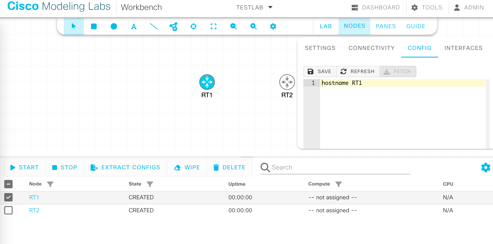

# CML2自動プロビジョニング
## lab を作成
コマンド投入
```bash
(pyats_CML) ainas@mngt:~/pyats_CML/test$ python3 lab_create.py testlab
terminal_server {'os': 'linux', 'type': 'server', 'credentials': {'default': {'username': 'admin', 'password': 'Veanus77!'}}, 'connections': {'cli': {'protocol': 'ssh', 'ip': '192.168.10.189', 'port': 22}}}
RT1 {'os': 'ios', 'type': 'router', 'platform': 'iosv', 'credentials': {'default': {'username': 'admin', 'password': 'admin'}}, 'connections': {'defaults': {'class': 'unicon.Unicon'}, 'a': {'protocol': 'telnet', 'proxy': 'terminal_server', 'command': 'open /pyATS-Test/RT1/0'}}}
RT2 {'os': 'iosxe', 'type': 'router', 'platform': 'csr1000v', 'credentials': {'default': {'username': 'admin', 'password': 'admin'}}, 'connections': {'defaults': {'class': 'unicon.Unicon'}, 'a': {'protocol': 'telnet', 'proxy': 'terminal_server', 'command': 'open /pyATS-Test/RT2/0'}}}
```
作成結果


## config投入
```bash
(pyats_CML) ainas@mngt:~/pyats_CML/test/config$ python3 ./ios_config.py ./pram/RT1.yaml 

2023-07-29 23:25:00,346: %UNICON-INFO: +++ RT1 logfile /tmp/RT1-cli-20230729T232500345.log +++

2023-07-29 23:25:00,347: %UNICON-INFO: +++ Unicon plugin ios/iosv (unicon.plugins.ios.iosv) +++

2023-07-29 23:25:00,348: %UNICON-INFO: connection via proxy terminal_server

2023-07-29 23:25:00,352: %UNICON-INFO: +++ connection to spawn: ssh -l admin 192.168.10.189 -p 22, id: 140417506315856 +++

2023-07-29 23:25:00,353: %UNICON-INFO: connection to terminal_server
admin@192.168.10.189's password: 

****
CML2 Console Server
Copyright (c) 2019-2023 Cisco Systems, Inc. and/or its affiliates
****

tab completion works
list available nodes and node labels / IDs with "list"
it's also possible to do a "open /Lab at Wed 22:21 PM/iosv-0/0" command
or to directly connect via UUID "connect 697bb5b8-7181-49c5-8e85-540eacf9deac"
(e.g. lab name followed by node name and line number

consoles> 

2023-07-29 23:25:00,664: %UNICON-INFO: +++ initializing handle +++

2023-07-29 23:25:00,667: %UNICON-INFO: connection to RT1
consoles> open /pyATS-Test/RT1/0
Connecting to console for RT1
Connected to CML terminalserver.
Escape character is '^]'.

**************************************************************************
* IOSv is strictly limited to use for evaluation, demonstration and IOS  *
* education. IOSv is provided as-is and is not supported by Cisco's      *
* Technical Advisory Center. Any use or disclosure, in whole or in part, *
* of the IOSv Software or Documentation to any third party for any       *
* purposes is expressly prohibited except as otherwise authorized by     *
* Cisco in writing.                                                      *
**************************************************************************
RT1>
RT1>

2023-07-29 23:25:02,618: %UNICON-INFO: +++ initializing handle +++
enable
RT1#

2023-07-29 23:25:02,790: %UNICON-INFO: +++ RT1 with via 'a': executing command 'term length 0' +++
term length 0
RT1#

2023-07-29 23:25:03,053: %UNICON-INFO: +++ RT1 with via 'a': executing command 'term width 0' +++
term width 0
RT1#

2023-07-29 23:25:03,360: %UNICON-INFO: +++ RT1 with via 'a': executing command 'show version' +++
show version
Cisco IOS Software, IOSv Software (VIOS-ADVENTERPRISEK9-M), Version 15.9(3)M6, RELEASE SOFTWARE (fc1)
Technical Support: http://www.cisco.com/techsupport
Copyright (c) 1986-2022 by Cisco Systems, Inc.
Compiled Mon 08-Aug-22 15:22 by mcpre


ROM: Bootstrap program is IOSv

RT1 uptime is 2 minutes
System returned to ROM by reload
System image file is "flash0:/vios-adventerprisek9-m"
Last reload reason: Unknown reason


This product contains cryptographic features and is subject to United
States and local country laws governing import, export, transfer and
use. Delivery of Cisco cryptographic products does not imply
third-party authority to import, export, distribute or use encryption.
Importers, exporters, distributors and users are responsible for
compliance with U.S. and local country laws. By using this product you
agree to comply with applicable laws and regulations. If you are unable
to comply with U.S. and local laws, return this product immediately.

A summary of U.S. laws governing Cisco cryptographic products may be found at:
http://www.cisco.com/wwl/export/crypto/tool/stqrg.html

If you require further assistance please contact us by sending email to
export@cisco.com.

Cisco IOSv (revision 1.0) with  with 460001K/62464K bytes of memory.
Processor board ID 9WEFWOZJM9IG3PJSI8M25
4 Gigabit Ethernet interfaces
DRAM configuration is 72 bits wide with parity disabled.
256K bytes of non-volatile configuration memory.
2097152K bytes of ATA System CompactFlash 0 (Read/Write)
0K bytes of ATA CompactFlash 1 (Read/Write)
11217K bytes of ATA CompactFlash 2 (Read/Write)
0K bytes of ATA CompactFlash 3 (Read/Write)


Configuration register is 0x0

RT1#

2023-07-29 23:25:05,720: %UNICON-INFO: +++ RT1 with via 'a': configure +++
config term
Enter configuration commands, one per line.  End with CNTL/Z.
RT1(config)#no logging console
RT1(config)#line console 0
RT1(config-line)#exec-timeout 0
RT1(config-line)#line vty 0 4
RT1(config-line)#exec-timeout 0
RT1(config-line)#end
RT1#

2023-07-29 23:25:06,882: %UNICON-INFO: +++ RT1 with via 'a': executing command 'show run' +++
show run
Building configuration...

Current configuration : 2981 bytes
!
! Last configuration change at 14:25:04 UTC Sat Jul 29 2023
!
version 15.9
service timestamps debug datetime msec
service timestamps log datetime msec
no service password-encryption
!
hostname RT1
!
boot-start-marker
boot-end-marker
!
!
no logging console
!
no aaa new-model
!
!
!
mmi polling-interval 60
no mmi auto-configure
no mmi pvc
mmi snmp-timeout 180
!
!
!
!
!
!
!
!
!
!
!
ip cef
no ipv6 cef
!
multilink bundle-name authenticated
!
!
!
!
!
redundancy
!
!
! 
!
!
!
!
!
!
!
!
!
!
!
!
interface GigabitEthernet0/0
 no ip address
 shutdown
 duplex auto
 speed auto
 media-type rj45
!
interface GigabitEthernet0/1
 no ip address
 shutdown
 duplex auto
 speed auto
 media-type rj45
!
interface GigabitEthernet0/2
 no ip address
 shutdown
 duplex auto
 speed auto
 media-type rj45
!
interface GigabitEthernet0/3
 no ip address
 shutdown
 duplex auto
 speed auto
 media-type rj45
!
ip forward-protocol nd
!
!
no ip http server
no ip http secure-server
!
ipv6 ioam timestamp
!
!
!
control-plane
!
banner exec ^C
**************************************************************************
* IOSv is strictly limited to use for evaluation, demonstration and IOS  *
* education. IOSv is provided as-is and is not supported by Cisco's      *
* Technical Advisory Center. Any use or disclosure, in whole or in part, *
* of the IOSv Software or Documentation to any third party for any       *
* purposes is expressly prohibited except as otherwise authorized by     *
* Cisco in writing.                                                      *
**************************************************************************^C
banner incoming ^C
**************************************************************************
* IOSv is strictly limited to use for evaluation, demonstration and IOS  *
* education. IOSv is provided as-is and is not supported by Cisco's      *
* Technical Advisory Center. Any use or disclosure, in whole or in part, *
* of the IOSv Software or Documentation to any third party for any       *
* purposes is expressly prohibited except as otherwise authorized by     *
* Cisco in writing.                                                      *
**************************************************************************^C
banner login ^C
**************************************************************************
* IOSv is strictly limited to use for evaluation, demonstration and IOS  *
* education. IOSv is provided as-is and is not supported by Cisco's      *
* Technical Advisory Center. Any use or disclosure, in whole or in part, *
* of the IOSv Software or Documentation to any third party for any       *
* purposes is expressly prohibited except as otherwise authorized by     *
* Cisco in writing.                                                      *
**************************************************************************^C
!
line con 0
 exec-timeout 0 0
line aux 0
line vty 0 4
 exec-timeout 0 0
 login
 transport input none
!
no scheduler allocate
!
end

RT1#
Building configuration...

Current configuration : 2981 bytes
!
! Last configuration change at 14:25:04 UTC Sat Jul 29 2023
!
version 15.9
service timestamps debug datetime msec
service timestamps log datetime msec
no service password-encryption
!
hostname RT1
!
boot-start-marker
boot-end-marker
!
!
no logging console
!
no aaa new-model
!
!
!
mmi polling-interval 60
no mmi auto-configure
no mmi pvc
mmi snmp-timeout 180
!
!
!
!
!
!
!
!
!
!
!
ip cef
no ipv6 cef
!
multilink bundle-name authenticated
!
!
!
!
!
redundancy
!
!
! 
!
!
!
!
!
!
!
!
!
!
!
!
interface GigabitEthernet0/0
 no ip address
 shutdown
 duplex auto
 speed auto
 media-type rj45
!
interface GigabitEthernet0/1
 no ip address
 shutdown
 duplex auto
 speed auto
 media-type rj45
!
interface GigabitEthernet0/2
 no ip address
 shutdown
 duplex auto
 speed auto
 media-type rj45
!
interface GigabitEthernet0/3
 no ip address
 shutdown
 duplex auto
 speed auto
 media-type rj45
!
ip forward-protocol nd
!
!
no ip http server
no ip http secure-server
!
ipv6 ioam timestamp
!
!
!
control-plane
!
banner exec ^C
**************************************************************************
* IOSv is strictly limited to use for evaluation, demonstration and IOS  *
* education. IOSv is provided as-is and is not supported by Cisco's      *
* Technical Advisory Center. Any use or disclosure, in whole or in part, *
* of the IOSv Software or Documentation to any third party for any       *
* purposes is expressly prohibited except as otherwise authorized by     *
* Cisco in writing.                                                      *
**************************************************************************^C
banner incoming ^C
**************************************************************************
* IOSv is strictly limited to use for evaluation, demonstration and IOS  *
* education. IOSv is provided as-is and is not supported by Cisco's      *
* Technical Advisory Center. Any use or disclosure, in whole or in part, *
* of the IOSv Software or Documentation to any third party for any       *
* purposes is expressly prohibited except as otherwise authorized by     *
* Cisco in writing.                                                      *
**************************************************************************^C
banner login ^C
**************************************************************************
* IOSv is strictly limited to use for evaluation, demonstration and IOS  *
* education. IOSv is provided as-is and is not supported by Cisco's      *
* Technical Advisory Center. Any use or disclosure, in whole or in part, *
* of the IOSv Software or Documentation to any third party for any       *
* purposes is expressly prohibited except as otherwise authorized by     *
* Cisco in writing.                                                      *
**************************************************************************^C
!
line con 0
 exec-timeout 0 0
line aux 0
line vty 0 4
 exec-timeout 0 0
 login
 transport input none
!
no scheduler allocate
!
end

2023-07-29 23:25:11,666: %UNICON-INFO: +++ RT1 with via 'a': configure +++
config term
Enter configuration commands, one per line.  End with CNTL/Z.
RT1(config)#! BGP Configuration
RT1(config)#router bgp 65000
RT1(config-router)#neighbor 198.51.100.1 remote-as 65000
RT1(config-router)#
RT1(config-router)#! Interface Configuration for loopback 0
RT1(config-router)#  interface loopback 0
RT1(config-if)#    ip address 10.0.4.1 255.255.255.255
RT1(config-if)#no shutdown
RT1(config-if)#
RT1(config-if)#! Interface Configuration for GigabitEthernet 0/1
RT1(config-if)#  interface GigabitEthernet 0/1
RT1(config-if)#    ip address 198.51.100.1 255.255.255.252
RT1(config-if)#no shutdown
RT1(config-if)#
RT1(config-if)#! Interface Configuration for GigabitEthernet 0/0
RT1(config-if)#  interface GigabitEthernet 0/0
RT1(config-if)#    ip address 203.0.113.1 255.255.255.0
RT1(config-if)#shutdown
RT1(config-if)#end
RT1#

2023-07-29 23:25:14,780: %UNICON-INFO: +++ RT1 with via 'a': executing command 'show run' +++
show run
Building configuration...

Current configuration : 3163 bytes
!
! Last configuration change at 14:25:12 UTC Sat Jul 29 2023
!
version 15.9
service timestamps debug datetime msec
service timestamps log datetime msec
no service password-encryption
!
hostname RT1
!
boot-start-marker
boot-end-marker
!
!
no logging console
!
no aaa new-model
!
!
!
mmi polling-interval 60
no mmi auto-configure
no mmi pvc
mmi snmp-timeout 180
!
!
!
!
!
!
!
!
!
!
!
ip cef
no ipv6 cef
!
multilink bundle-name authenticated
!
!
!
!
!
redundancy
!
!
! 
!
!
!
!
!
!
!
!
!
!
!
!
interface Loopback0
 ip address 10.0.4.1 255.255.255.255
!
interface GigabitEthernet0/0
 ip address 203.0.113.1 255.255.255.0
 shutdown
 duplex auto
 speed auto
 media-type rj45
!
interface GigabitEthernet0/1
 ip address 198.51.100.1 255.255.255.252
 duplex auto
 speed auto
 media-type rj45
!
interface GigabitEthernet0/2
 no ip address
 shutdown
 duplex auto
 speed auto
 media-type rj45
!
interface GigabitEthernet0/3
 no ip address
 shutdown
 duplex auto
 speed auto
 media-type rj45
!
router bgp 65000
 bgp log-neighbor-changes
 neighbor 198.51.100.1 remote-as 65000
!
ip forward-protocol nd
!
!
no ip http server
no ip http secure-server
!
ipv6 ioam timestamp
!
!
!
control-plane
!
banner exec ^C
**************************************************************************
* IOSv is strictly limited to use for evaluation, demonstration and IOS  *
* education. IOSv is provided as-is and is not supported by Cisco's      *
* Technical Advisory Center. Any use or disclosure, in whole or in part, *
* of the IOSv Software or Documentation to any third party for any       *
* purposes is expressly prohibited except as otherwise authorized by     *
* Cisco in writing.                                                      *
**************************************************************************^C
banner incoming ^C
**************************************************************************
* IOSv is strictly limited to use for evaluation, demonstration and IOS  *
* education. IOSv is provided as-is and is not supported by Cisco's      *
* Technical Advisory Center. Any use or disclosure, in whole or in part, *
* of the IOSv Software or Documentation to any third party for any       *
* purposes is expressly prohibited except as otherwise authorized by     *
* Cisco in writing.                                                      *
**************************************************************************^C
banner login ^C
**************************************************************************
* IOSv is strictly limited to use for evaluation, demonstration and IOS  *
* education. IOSv is provided as-is and is not supported by Cisco's      *
* Technical Advisory Center. Any use or disclosure, in whole or in part, *
* of the IOSv Software or Documentation to any third party for any       *
* purposes is expressly prohibited except as otherwise authorized by     *
* Cisco in writing.                                                      *
**************************************************************************^C
!
line con 0
 exec-timeout 0 0
line aux 0
line vty 0 4
 exec-timeout 0 0
 login
 transport input none
!
no scheduler allocate
!
end

RT1#
Building configuration...

Current configuration : 3163 bytes
!
! Last configuration change at 14:25:12 UTC Sat Jul 29 2023
!
version 15.9
service timestamps debug datetime msec
service timestamps log datetime msec
no service password-encryption
!
hostname RT1
!
boot-start-marker
boot-end-marker
!
!
no logging console
!
no aaa new-model
!
!
!
mmi polling-interval 60
no mmi auto-configure
no mmi pvc
mmi snmp-timeout 180
!
!
!
!
!
!
!
!
!
!
!
ip cef
no ipv6 cef
!
multilink bundle-name authenticated
!
!
!
!
!
redundancy
!
!
! 
!
!
!
!
!
!
!
!
!
!
!
!
interface Loopback0
 ip address 10.0.4.1 255.255.255.255
!
interface GigabitEthernet0/0
 ip address 203.0.113.1 255.255.255.0
 shutdown
 duplex auto
 speed auto
 media-type rj45
!
interface GigabitEthernet0/1
 ip address 198.51.100.1 255.255.255.252
 duplex auto
 speed auto
 media-type rj45
!
interface GigabitEthernet0/2
 no ip address
 shutdown
 duplex auto
 speed auto
 media-type rj45
!
interface GigabitEthernet0/3
 no ip address
 shutdown
 duplex auto
 speed auto
 media-type rj45
!
router bgp 65000
 bgp log-neighbor-changes
 neighbor 198.51.100.1 remote-as 65000
!
ip forward-protocol nd
!
!
no ip http server
no ip http secure-server
!
ipv6 ioam timestamp
!
!
!
control-plane
!
banner exec ^C
**************************************************************************
* IOSv is strictly limited to use for evaluation, demonstration and IOS  *
* education. IOSv is provided as-is and is not supported by Cisco's      *
* Technical Advisory Center. Any use or disclosure, in whole or in part, *
* of the IOSv Software or Documentation to any third party for any       *
* purposes is expressly prohibited except as otherwise authorized by     *
* Cisco in writing.                                                      *
**************************************************************************^C
banner incoming ^C
**************************************************************************
* IOSv is strictly limited to use for evaluation, demonstration and IOS  *
* education. IOSv is provided as-is and is not supported by Cisco's      *
* Technical Advisory Center. Any use or disclosure, in whole or in part, *
* of the IOSv Software or Documentation to any third party for any       *
* purposes is expressly prohibited except as otherwise authorized by     *
* Cisco in writing.                                                      *
**************************************************************************^C
banner login ^C
**************************************************************************
* IOSv is strictly limited to use for evaluation, demonstration and IOS  *
* education. IOSv is provided as-is and is not supported by Cisco's      *
* Technical Advisory Center. Any use or disclosure, in whole or in part, *
* of the IOSv Software or Documentation to any third party for any       *
* purposes is expressly prohibited except as otherwise authorized by     *
* Cisco in writing.                                                      *
**************************************************************************^C
!
line con 0
 exec-timeout 0 0
line aux 0
line vty 0 4
 exec-timeout 0 0
 login
 transport input none
!
no scheduler allocate
!
end
```